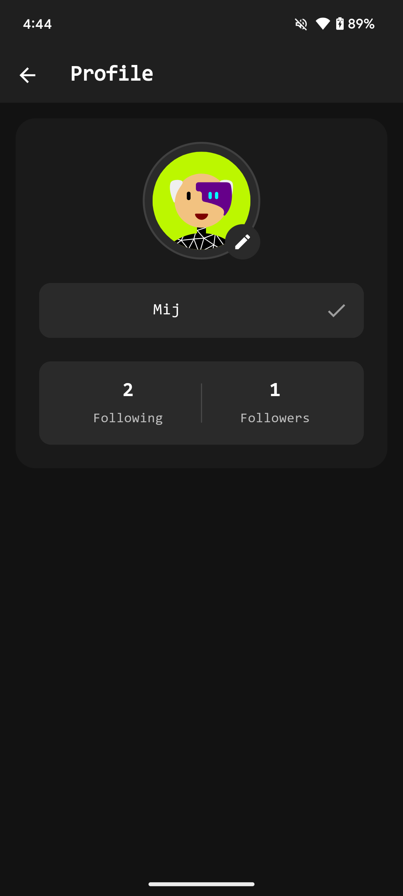

**# Chatter Mobile

<p align="center">
  
</p>

A modern real-time chat application built with Flutter and Firebase, featuring a sleek dark theme
interface and comprehensive social features.

## ✨ Features

### 🔐 Authentication

- Email & Password Authentication
- Secure Login and Sign Up
- Password Reset Functionality
- Persistent Login State

### 👤 Profile Management

- Customizable User Profiles
- Random Avatar Generator
- Simple Avatar Option (Initial Letter)
- Real-time Name Updates
- Profile Picture Customization

### 💬 Chat Features

- Real-time Messaging
- Message Read Status
- Timestamp Indicators
- Clean Chat Interface
- Message History

### 🔔 Notifications

- Push Notifications for New Messages
- In-App Notifications for:
    - New Followers
    - Message Alerts
    - System Updates
- Notification Management
- Read/Unread Status

### 👥 Social Features

- Follow/Unfollow Users
- Followers & Following Lists
- Real-time Online Status
- User Search
- User Profiles Viewing

### 🎨 UI/UX

- Dark Theme
- Smooth Animations
- Intuitive Navigation
- Responsive Design
- Loading States
- Error Handling
- Custom Snackbar Notifications

## 🛠️ Technical Implementation

### Architecture

- Provider State Management
- Firebase Real-time Database
- Clean Architecture Principles
- Service-based Structure

### Backend Services

- Firebase Authentication
- Firebase Realtime Database
- Firebase Cloud Messaging
- Firebase Cloud Functions

### Performance

- Optimistic UI Updates
- Efficient Data Caching
- Background Operations
- Memory Management

## 📱 Screenshots

<p align="center">
  
  
  
  
</p>

## 🚀 Getting Started

### Prerequisites

- Flutter SDK
- Firebase Account
- Android Studio / VS Code

### Installation

1. Clone the repository

```bash
git clone https://github.com/muzzammil763/Chatter.git
**# Web Chatter Mobile

<p align="center">
  
</p>

A modern real-time chat application built with Flutter and Firebase, featuring a sleek dark theme interface and comprehensive social features.

## ✨ Features

### 🔐 Authentication
- Email & Password Authentication
- Secure Login and Sign Up
- Password Reset Functionality
- Persistent Login State

### 👤 Profile Management
- Customizable User Profiles
- Random Avatar Generator
- Simple Avatar Option (Initial Letter)
- Real-time Name Updates
- Profile Picture Customization

### 💬 Chat Features
- Real-time Messaging
- Message Read Status
- Timestamp Indicators
- Clean Chat Interface
- Message History

### 🔔 Notifications
- Push Notifications for New Messages
- In-App Notifications for:
  - New Followers
  - Message Alerts
  - System Updates
- Notification Management
- Read/Unread Status

### 👥 Social Features
- Follow/Unfollow Users
- Followers & Following Lists
- Real-time Online Status
- User Search
- User Profiles Viewing

### 🎨 UI/UX
- Dark Theme
- Smooth Animations
- Intuitive Navigation
- Responsive Design
- Loading States
- Error Handling
- Custom Snackbar Notifications

## 🛠️ Technical Implementation

### Architecture
- Provider State Management
- Firebase Real-time Database
- Clean Architecture Principles
- Service-based Structure

### Backend Services
- Firebase Authentication
- Firebase Realtime Database
- Firebase Cloud Messaging
- Firebase Cloud Functions

### Performance
- Optimistic UI Updates
- Efficient Data Caching
- Background Operations
- Memory Management

## 📱 Screenshots

<p align="center">
  
  
  
  
</p>

## 🚀 Getting Started

### Prerequisites
- Flutter SDK
- Firebase Account
- Android Studio / VS Code

### Installation

1. Clone the repository
```bash
git clone https://github.com/yourusername/web_chatter_mobile.git
```

2. Install dependencies

```bash
flutter pub get
```

3. Configure Firebase

- Create a new Firebase project
- Add your `google-services.json` for Android
- Enable Authentication and Realtime Database

4. Run the app

```bash
flutter run
```

## 🔧 Configuration

### Firebase Setup

1. Enable Email/Password authentication
2. Set up Realtime Database rules
3. Configure Cloud Messaging
4. Set up Cloud Functions (if using)

### Database Rules

```json
{
  "rules": {
    "users": {
      ".read": "auth != null",
      "$uid": {
        ".write": "auth != null && auth.uid == $uid"
      }
    },
    "chats": {
      "$chatId": {
        ".read": "auth != null && (chatId.contains(auth.uid))",
        ".write": "auth != null && (chatId.contains(auth.uid))"
      }
    }
  }
}
```

## 🛡️ Security

- Secure Authentication Flow
- Protected Database Rules
- Encrypted Data Transfer
- Safe User Data Handling

## 🔄 State Management

- Provider for App State
- Real-time Data Sync
- Optimistic UI Updates
- Persistent State Management

## 📦 Dependencies

```yaml
dependencies:
  flutter:
    sdk: flutter
  firebase_core: ^x.x.x
  firebase_auth: ^x.x.x
  firebase_database: ^x.x.x
  provider: ^x.x.x
  random_avatar: ^x.x.x
  # Add other dependencies
```

## 🤝 Contributing

1. Fork the Project
2. Create your Feature Branch (`git checkout -b feature/AmazingFeature`)
3. Commit your Changes (`git commit -m 'Add some AmazingFeature'`)
4. Push to the Branch (`git push origin feature/AmazingFeature`)
5. Open a Pull Request

## 📄 License

Distributed under the MIT License. See `LICENSE` for more information.

## 📞 Contact

Your Name - [@muzzammil763](https://github.com/muzzammil763)

## 🙏 Acknowledgments

- [Flutter](https://flutter.dev)
- [Firebase](https://firebase.google.com)
- [Provider](https://pub.dev/packages/provider)
- [Random Avatar](https://pub.dev/packages/random_avatar)
